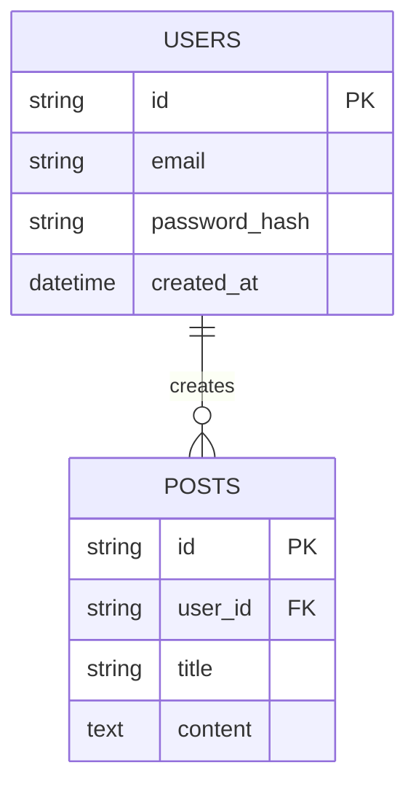

# Database Schema & Relationships

Dokumentasi ini adalah *Single Source of Truth* untuk skema database. Setiap ada *migration* atau perubahan tabel, file ini WAJIB diupdate.

## 1. ERD / Tabel Relasi Utama

*(Gunakan format Mermaid JS jika memungkinkan)*

## 2. Daftar Tabel & Penjelasan

### `users`
Tabel untuk menyimpan data autentikasi dan profil pengguna.
- `id` (UUID): Primary Key
- `email` (String): Unique index

### `posts`
Menyimpan konten yang dibuat pengguna.
- `user_id` (UUID): Foreign Key ke `users.id` (ON DELETE CASCADE)